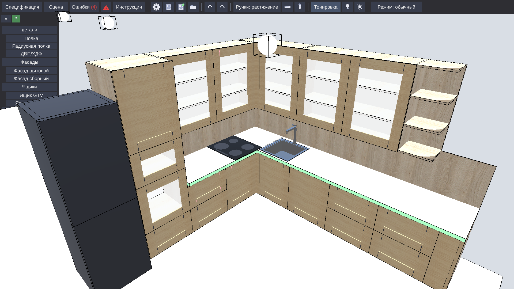
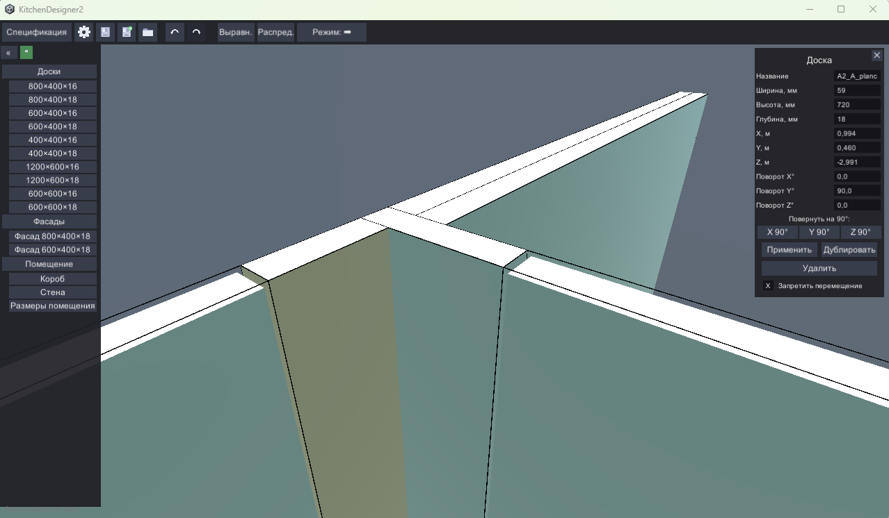
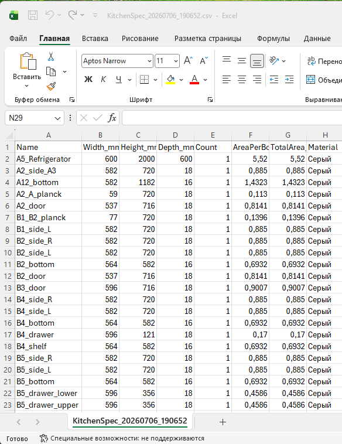

<p align="center">
  <h1 align="center">Kitchen Designer</h1>
  <p align="center">
    3D Furniture Board Constructor / 3D-конструктор мебельных щитов<br>
    Unity 6000 • C# • URP • ASP.NET Core 10 • PostgreSQL
  </p>
</p>

<p align="center">
  <a href="LICENSE"></a>
  <a href="http://192.168.0.189:23080"></a>
</p>

<p align="center">
  
</p>

---

## English

### Overview

A visual 3D furniture board constructor for laying out cabinets, kitchens, and other case furniture.

**Live demo:** [http://192.168.0.189:23080](http://192.168.0.189:23080)

### Features

- **Create boards** of arbitrary size or from presets
- **Face-to-face snapping** — boards automatically snap to each other's faces (configurable threshold)
- **Grid snapping** — configurable grid step (default 1 mm)
- **Spatial grid** — optional 3D grid rendered on the floor
- **Facade gaps** — per-side gap control (left, right, top, bottom; default 2 mm each)

  

- **Validation system** — automatic intersection and connectivity checking (BFS from walls/floor); violations highlighted in red
- **Block on violation** — optionally prevent moves that make the structure invalid
- **Groups (modules)** — group boards into named modules, move them as one
- **Module edit mode** — edit one module while others are locked and dimmed
- **Specification** — bill of materials with dimensions and area, export to CSV

  

- **Save/Load** — projects saved as JSON. Load a ready-made configuration from file (see `docs/example.save.json`)
- **Auto-save** — configurable interval, only when changes detected. **Backup** — on manual save, the old file is archived to `saves/backups/`
- **Undo/Redo** — command stack of up to 1000 operations
- **Camera controls** — orbit (RMB), pan (MMB), zoom (scroll), WASD movement
- **Resize handles** — interactive resize via handles on selected boards
- **Material catalog** — apply textures/decor to boards
- **Wall cutaway** (Sims-like) — walls lower to 100 mm when near for visibility
- **Edge outlines** — optional board edge highlighting
- **Align/Distribute** — align and evenly distribute boards

### MCP Bridge (AI-driven modeling)

Kitchen Designer is available via **MCP (Model Context Protocol)** — an AI agent can model the construction autonomously.

Any MCP-compatible AI agent (Claude Code, opencode, etc.) can read the scene, create/move/resize boards, check violations, control the camera, and export specifications.

To connect an agent, simply ask it to read the [`readme-mcp.md`](readme-mcp.md) file and follow the workflow described there.

### Quick Start

```bash
# Open in Unity Editor
# Open Assets/Scenes/TestScene.unity
# Hit Play
```

### Launch configurations

**Local (debug):**

| Script | Purpose |
|--------|---------|
| `run-desktop.cmd` | Fastest iteration: incremental Windows development build (Mono) → `Build_Debug/`, launches the exe. `-NoBuild` to just launch |
| `run-webgl.cmd` | WebGL debug in Docker: builds `Builds/WebGL_Debug` (no compression, no stripping), starts nginx+web+db from `server/docker-compose.local.yml`, opens http://localhost:8080. nginx bind-mounts the build folder — rebuild WebGL and refresh the browser, no docker restart needed. `-NoBuild` to skip the Unity build |

**Release:**

| Script | Purpose |
|--------|---------|
| `build.cmd -WebGL` | WebGL release build (gzip, high stripping) → `Builds/WebGL` |
| `deploy.cmd` | Publish server + copy WebGL build + `server/docker-compose.yml` to the production host |

**Measured build times** (Ryzen-class dev machine, warm Library cache; wall time includes ~15 s Unity editor startup):

| Variant | Wall time | Unity pipeline | Output size |
|---------|-----------|----------------|-------------|
| Windows Debug, incremental (`-WinDebug`) | 19 s | 6 s | 157 MB |
| Windows Debug, first run | 71 s | 55 s | 157 MB |
| WebGL Debug (`-WebGLDebug`) | 73 s | 56 s | 200 MB |
| WebGL Release (`-WebGL`) | 9.5 min | 549 s | 13.5 MB |

### Server architecture

The `web` container is self-contained and exposes **two ports**:

| Port | Purpose | Routes |
|------|---------|--------|
| 8080 | HTTP — site, API, WebGL | Blazor pages, `/api/*`, `/unity/*` (WebGL build from the `WebGL:RootPath` mount), `/api/mcp/ws` (client channel) |
| 8081 | MCP — AI agents only | `/mcp` (real MCP over Streamable HTTP), `/health` |

nginx is a pure reverse proxy in front of 8080; agents connect to 8081 directly. The database schema is created automatically on first start (with retries while PostgreSQL boots). Project saves are **files** under `/app/data/projects/{userId}/{projectId}.json` (source of truth, size limit + JSON validation + rotated `.bak` backups); the DB keeps metadata. Auth: ASP.NET Identity with static-SSR login/register/profile pages, POST-only logout, lockout after failed attempts, 401/403 (not redirects) for `/api/*`.

MCP flow: the server hosts a **real MCP server** at `http(s)://…:8081/mcp` (Streamable HTTP). The tool set is generated from one C# contract (`Assets/Scripts/Core/MCP/Contract`, shared with the Unity handler; `index.ts` is generated from it too). The agent connects, then **must call `authenticate` first** with the tab's project key — until then every tool returns *"требуется подключение к проекту…"*. The user opens the project in a tab (a unique key is shown in the top nav next to a red/green light), copies the key to the agent; on authenticate the server pings that tab over `/api/mcp/ws`, binds the MCP session to it (light turns green), and relays all subsequent commands to it.

### Scripts

| Script | Purpose |
|--------|---------|
| `build.cmd` | Build Windows (.exe) or WebGL. Flags: `-Clean`, `-RunTests`, `-RunPlayMode`, `-BuildOnly`, `-WebGL`, `-WebGLDebug`, `-WinDebug` |
| `build-server.cmd` | Build ASP.NET server |
| `clean.cmd` | Clean temporary files (Unity + server) |

### Stack

| Component | Version |
|-----------|---------|
| Unity | 6000.4.3f1 |
| Render Pipeline | URP 17.4.0 |
| Language (front) | C# |
| Backend | ASP.NET Core 10 + Blazor Server |
| Orchestration | .NET Aspire 13 |
| Auth | ASP.NET Identity |
| Database | PostgreSQL |
| Tests | Unity Test Framework (NUnit) |

---

## Русский

### Что это

Визуальный 3D-конструктор для раскладки мебельных щитов (досок). Позволяет проектировать кухни, шкафы и другую корпусную мебель.

**Демо:** [http://192.168.0.189:23080](http://192.168.0.189:23080)

### Возможности

- **Создание досок** произвольных размеров или из пресетов
- **Face-to-face snapping** — доски автоматически прилипают друг к другу гранями (порог настраивается)
- **Привязка к сетке** — шаг сетки настраивается (по умолчанию 1 мм)
- **Пространственная сетка** — опциональная 3D-сетка на полу
- **Зазоры фасадов** — у фасадных элементов можно выставить зазор слева, справа, сверху и снизу (по умолчанию 2 мм с каждой стороны)

  

- **Система проверки** — автоматический контроль пересечений и связности конструкции (BFS от пола/стен); нарушения подсвечиваются красным
- **Блокировка при нарушениях** — опционально запрещает перемещение, если конструкция становится невалидной
- **Группы (модули)** — объединение досок в именованные группы, перемещение целиком
- **Режим редактирования модуля** — редактирование одного модуля, остальные блокируются и затемняются
- **Спецификация** — таблица всех деталей с размерами и площадью, экспорт в CSV

  

- **Сохранение/загрузка** — проекты сохраняются в JSON. Можно загрузить готовую конфигурацию из файла (см. `docs/example.save.json`)
- **Автосохранение** — с настраиваемым интервалом, только при наличии изменений. **Бекап** — при ручном сохранении старый файл архивируется в `saves/backups/`
- **Undo/Redo** — стек команд до 1000 операций
- **Управление камерой** — орбита (ПКМ), панорама (СММ), зум (колесо), WASD
- **Ручки изменения размера** — интерактивное изменение через ручки на выделенной доске
- **Каталог материалов** — применение текстур/декора к доскам
- **Обрезка стен** (Sims-like) — при наведении стены опускаются до 100 мм для обзора
- **Edge Outline** — опциональная подсветка рёбер досок
- **Align/Распределение** — выравнивание и равномерное распределение досок

### Управление через MCP (нейросеть)

Kitchen Designer доступен по **MCP (Model Context Protocol)** — ИИ-агент может моделировать конструкцию самостоятельно.

Любой MCP-совместимый ИИ-агент (вроде Claude Code, opencode и т.п.) может читать сцену, создавать/перемещать/изменять доски, проверять нарушения, управлять камерой и экспортировать спецификацию.

Для подключения агента достаточно попросить его прочитать файл [`readme-mcp.md`](readme-mcp.md) и следовать описанному там рабочему циклу.

### Быстрый старт

```bash
# Открыть проект в Unity Editor
# Открыть Assets/Scenes/TestScene.unity
# Нажать Play
```

### Скрипты

| Скрипт | Назначение |
|--------|-----------|
| `build.cmd` | Сборка Windows (.exe) или WebGL. Флаги: `-Clean`, `-RunTests`, `-RunPlayMode`, `-BuildOnly`, `-WebGL`, `-WebGLDebug`, `-WinDebug` |
| `build-server.cmd` | Сборка ASP.NET сервера |
| `clean.cmd` | Очистка временных файлов (Unity + сервер) |

### Конфигурации запуска

**Локально (отладка):**

| Скрипт | Назначение |
|--------|-----------|
| `run-desktop.cmd` | Самая быстрая итерация: инкрементальная development-сборка Windows (Mono) → `Build_Debug/`, запускает exe. `-NoBuild` — только запуск |
| `run-webgl.cmd` | WebGL-отладка в Docker: собирает `Builds/WebGL_Debug` (без сжатия и стриппинга), поднимает nginx+web+db из `server/docker-compose.local.yml`, открывает http://localhost:8080. nginx монтирует папку сборки напрямую — пересобрал WebGL, обновил страницу, Docker не перезапускаешь. `-NoBuild` — пропустить сборку Unity |

**Релиз:**

| Скрипт | Назначение |
|--------|-----------|
| `build.cmd -WebGL` | Релизная сборка WebGL (gzip, high stripping) → `Builds/WebGL` |
| `deploy.cmd` | Публикация сервера + копирование WebGL-сборки и `server/docker-compose.yml` на прод-хост |

**Замеры сборки** (тёплый кеш Library; полное время включает ~15 с запуска редактора Unity):

| Вариант | Полное время | Пайплайн Unity | Размер |
|---------|--------------|----------------|--------|
| Windows Debug, инкрементально (`-WinDebug`) | 19 с | 6 с | 157 МБ |
| Windows Debug, первый прогон | 71 с | 55 с | 157 МБ |
| WebGL Debug (`-WebGLDebug`) | 73 с | 56 с | 200 МБ |
| WebGL Release (`-WebGL`) | 9,5 мин | 549 с | 13,5 МБ |

### Архитектура сервера

Контейнер `web` самодостаточен и открывает **два порта**:

| Порт | Назначение | Маршруты |
|------|-----------|----------|
| 8080 | HTTP — сайт, API, WebGL | Blazor-страницы, `/api/*`, `/unity/*` (WebGL-сборка из монтирования `WebGL:RootPath`), `/api/mcp/ws` (канал клиента) |
| 8081 | MCP — только ИИ-агенты | `/mcp` (настоящий MCP по Streamable HTTP), `/health` |

nginx — чистый reverse-proxy перед 8080; агенты подключаются к 8081 напрямую. Схема БД создаётся автоматически при первом старте (с ретраями, пока поднимается PostgreSQL). Сохранения проектов — **файлы** `/app/data/projects/{userId}/{projectId}.json` (источник истины; лимит размера, валидация JSON, ротация `.bak`-бекапов); в БД — метаданные. Аутентификация: ASP.NET Identity, static-SSR страницы входа/регистрации/профиля, выход только по POST, lockout после неудачных попыток, для `/api/*` — 401/403 вместо редиректов.

Поток MCP: сервер держит **настоящий MCP-сервер** на `http(s)://…:8081/mcp` (Streamable HTTP). Набор тулзов генерируется из одного C#-контракта (`Assets/Scripts/Core/MCP/Contract`, общего с Unity-обработчиком; из него же генерируется `index.ts`). Агент подключается и **первой командой обязан вызвать `authenticate`** с ключом проекта из вкладки — до этого любой тул отдаёт *«требуется подключение к проекту…»*. Пользователь открывает проект во вкладке (уникальный ключ показан в верхней навигации рядом с красной/зелёной лампочкой), копирует ключ агенту; на authenticate сервер пингует вкладку по `/api/mcp/ws`, привязывает к ней MCP-сессию (лампочка зеленеет) и ретранслирует туда все последующие команды.

### Стек

| Компонент | Версия |
|-----------|--------|
| Unity | 6000.4.3f1 |
| Render Pipeline | URP 17.4.0 |
| Язык (front) | C# |
| Бэкенд | ASP.NET Core 10 + Blazor Server |
| Оркестрация | .NET Aspire 13 |
| Аутентификация | ASP.NET Identity |
| База данных | PostgreSQL |
| Тесты | Unity Test Framework (NUnit) |

---

## Лицензия / License

MIT License. See [LICENSE](LICENSE) for details.
