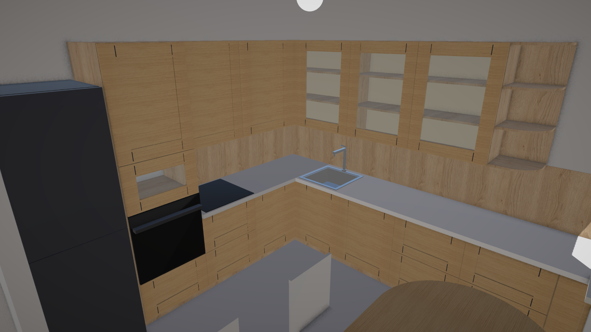
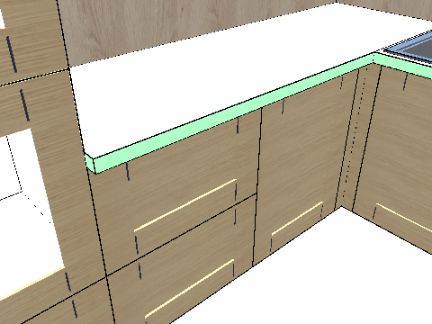
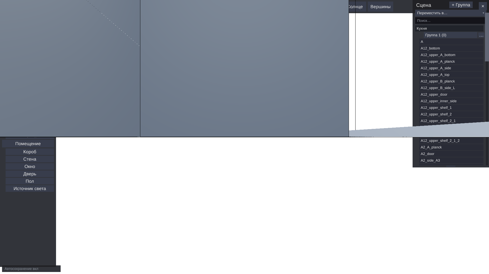
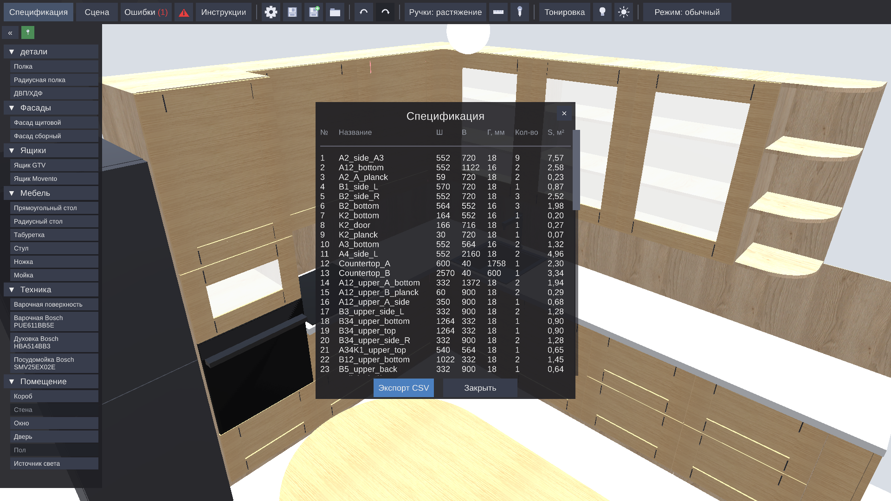

  <h1 align="center">Kitchen Designer</h1>
  

    3D-конструктор корпусной мебели: кухни, шкафы, столы 
    от расстановки коробов до спецификации деталей на распил
  

  

  

---

## Что это

Программа, в которой мебель собирается из **настоящих деталей**, а не из готовых
шкафов. Вы ставите боковины, полки, фасады и ящики — ровно те щиты, которые потом
поедут на распил. Поэтому спецификация в конце не «примерная»: в ней те же
размеры, что и в модели.

Всё измеряется в **миллиметрах**. Детали прилипают друг к другу гранями, зазоры
фасадов считаются сами, а конструкция постоянно проверяется на пересечения и на
то, что она вообще стоит на полу, а не висит в воздухе.

  

Слева — каталог элементов, сверху — панель инструментов, в центре — сцена.
Свойства выделенной детали открываются по правой кнопке мыши.

---

## Инструменты

### Каталог: из чего собирается мебель

| Группа | Что в ней |
|--------|-----------|
| **Детали** | Полка, радиусная полка, ДВП/ХДФ (тонкая задняя стенка) |
| **Фасады** | Фасад щитовой, фасад сборный (рамка с филёнкой) |
| **Ящики** | Ящик GTV, ящик Movento — с реальными формулами производителей |
| **Мебель** | Прямоугольный стол, радиусный стол, табуретка, стул, ножка, мойка |
| **Техника** | Варочная поверхность (свободного размера), варочная Bosch PUE611BB5E, духовка Bosch HBA514BR3, посудомоечная машина Bosch SMV25EX02E |
| **Помещение** | Короб, стена, окно, дверь, пол, источник света |

У встраиваемой техники габариты фиксированы — это модели производителя, а не
параллелепипеды «на глаз». Варочная поверхность сама прорезает проём в
столешнице.

### Панель инструментов

| Кнопка | Что делает |
|--------|-----------|
| **Спецификация** | Таблица всех деталей с размерами и площадью, выгрузка в CSV |
| **Сцена** | Дерево объектов проекта |
| **Ошибки** | Список нарушений; счётчик в кнопке, а стрелка рядом перебрасывает камеру к первой проблеме |
| **Инструкции** | Заметки к проекту (их же читает ИИ-агент, см. ниже) |
| ⚙ **Настройки** | Шаг сетки, порог прилипания, зазоры по умолчанию, автосохранение, качество фоторежима |
| 💾 / 💾+ / 📂 | Сохранить, сохранить как, загрузить |
| ↶ ↷ | Отменить / повторить — стек до 1000 операций |
| **Ручки: растяжение / перенос** | Что делают ручки на выделенной детали: тянут размер или двигают целиком |
| **Рулетка** | Замер расстояния между точками сцены |
| **Пипетка** | ПКМ — взять текстуру с детали, ЛКМ — применить на другую |
| **Тонировка** | Подсветка состояния деталей цветом (зелёная — в порядке, красная — нарушение) |
| 💡 **Свет** | Включить/выключить светильники сцены |
| ☀ **Солнце** | Время суток, азимут и яркость: от рассвета через зенит к закату и «луне» ночью |
| **Режим** | Обычный → помещение → фото |

### Ящики

Ящики строятся по формулам производителей (GTV AXIS PRO, Blum Movento):
номинальная длина, внутренняя ширина, высота бортов — всё как в каталоге
фурнитуры. Деревянный короб Movento попадает в спецификацию отдельными деталями.

Двойные ящики открываются по-настоящему — каждый ярус независимо:

  

### Зазоры фасадов

У фасадных деталей задаются зазоры слева, справа, сверху и снизу (по умолчанию
2 мм с каждой стороны). Программа держит их сама: сдвинули короб — фасад
пересчитался.

Режим **Edge Outline** обводит рёбра деталей контуром — так видно, где шов, а где
уже перекрытие:

  

  

### Спецификация и раскрой

Окно спецификации — это таблица деталей с размерами, количеством и площадью.
Оттуда же — выгрузка в CSV для распиловочного цеха:

  

### Проверка конструкции

- **Пересечения** — две детали не могут занимать одно место.
- **Связность** — обход в ширину от пола и стен: если деталь ни на что не
  опирается, она подсвечивается как нарушение.
- **Блокировка при нарушениях** — необязательный режим, в котором программа
  просто не даёт сдвинуть деталь так, чтобы конструкция стала невалидной.

### Сборка, привязки, выравнивание

- **Прилипание гранями** — детали примагничиваются друг к другу; порог
  настраивается.
- **Привязка к сетке** — шаг по умолчанию 1 мм.
- **Пространственная сетка** — необязательная 3D-сетка на полу для ориентировки.
- **Выравнивание и распределение** — поставить выделенные детали по одной линии
  или разложить с равными промежутками.
- **Ручки изменения размера** — тянуть габариты прямо в сцене.

### Модули

Детали объединяются в именованные **модули** (группы) и дальше двигаются целиком.
В **режиме редактирования модуля** остальная сцена блокируется и затемняется —
можно спокойно копаться внутри одного шкафа.

### Материалы и фоторежим

Каталог декоров (ЛДСП, МДФ, камень) применяется к деталям; текстура **мозаично
повторяется**, а не растягивается, поэтому рисунок дерева не «плывёт» на больших
щитах.

**Фоторежим** — отдельный режим для красивой картинки: достраивается потолок,
стены перестают прятаться, включаются тени, сглаживание, затенение и bloom.
Пресеты качества — от слабого железа до «всё включено». Заглавный кадр
этого README снят именно так.

В обычном режиме, наоборот, всё лёгкое: стены при наведении опускаются до
100 мм, чтобы не загораживать обзор (как в The Sims).

### Камера

| Действие | Как |
|----------|-----|
| Поворот на месте | ПКМ |
| Панорама | СКМ или ЛКМ по пустому месту |
| Приблизить/отдалить | Колесо |
| Ходить по сцене | WASD, с разгоном при удержании Shift |

### Файлы проекта

- **Сохранение в JSON.** Готовый пример — [`docs/example.save.json`](docs/example.save.json).
- **Рабочее место сохраняется вместе со сценой:** какие окна были открыты и где
  они стояли, состояние тумблеров «Тонировка» и «Свет».
- **Автосохранение** с настраиваемым интервалом — только если что-то менялось.
- **Бекап:** при ручном сохранении прежний файл уезжает в `saves/backups/`.

---

## Управление через нейросеть (MCP)

Kitchen Designer доступен по **MCP (Model Context Protocol)** — ИИ-агент может
моделировать конструкцию сам: читать сцену, создавать и двигать детали, менять
размеры, проверять нарушения, крутить камеру и выгружать спецификацию.

Подойдёт любой MCP-совместимый агент (Claude Code, opencode и подобные).
Чтобы подключить — попросите агента прочитать [`readme-mcp.md`](readme-mcp.md) и
следовать описанному там рабочему циклу.

---

## Документация

| Документ | О чём |
|----------|-------|
| [readme-mcp.md](readme-mcp.md) | Подключение ИИ-агента к запущенному приложению |
| [docs/DEVELOPMENT.md](docs/DEVELOPMENT.md) | Сборка, запуск, тесты, генераторы картинок для `docs/` |
| [docs/UI-GUIDELINES.md](docs/UI-GUIDELINES.md) | Свод правил интерфейса: единицы, отмена операций, глифы, снапшоты |
| [docs/TEXTURES.md](docs/TEXTURES.md) | Как добавить декор ЛДСП/МДФ/камня в каталог текстур |
| [docs/APPLIANCES-BRIEF.md](docs/APPLIANCES-BRIEF.md) | Встраиваемая техника Bosch: модели и их фиксированные габариты |
| [docs/GEOMETRY-EXTRACTION-PLAN.md](docs/GEOMETRY-EXTRACTION-PLAN.md) | Вынос геометрического ядра из Unity и мутационное тестирование |
| [docs/example.save.json](docs/example.save.json) | Пример проекта — его же открывают генераторы картинок |

---

## Стек

| Компонент | Версия |
|-----------|--------|
| Платформа | Windows (десктоп) |
| Unity | 6000.4.3f1 |
| Render Pipeline | URP 17.4.0 |
| Язык | C# |
| Тесты | Unity Test Framework (NUnit) |

Подробности сборки и запуска — в [docs/DEVELOPMENT.md](docs/DEVELOPMENT.md).

---

## Лицензия

MIT License. Подробнее в [LICENSE](LICENSE).
